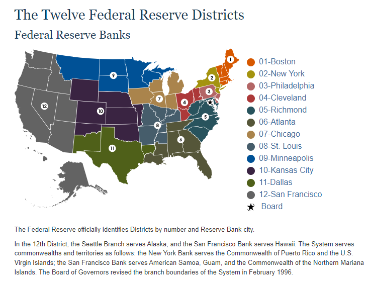

# 浅谈美联储

@author: Wubin Zhang/01208663

@dept: AI LAB of CMBCHINA

@date: Sep 29, 2024

## 1 美联储组织结构与运作
美联储(The Federal Reserve, FED)是美国的中央银行，致力于培育健全的金融体系和健康的经济，美联储的公共服务使命是通过促进我国货币、金融和支付系统的稳定性、完整性和效率来加强经济和社区，同时也负责制定和执行美国的货币政策。

美联储于1913年由国会成立，通过以下方式促进健康的经济和金融稳定：
- 制定国家的货币政策，以促进就业最大化、物价稳定和长期利率适度的经济目标。
- 通过监控金融体系风险和参与国内外支持美国家庭、社区和企业的健康经济，促进金融体系稳定。
- 监督和规范金融机构，以帮助确保个别机构的安全和稳健，并监测其对整个金融体系的影响。美联储还向存款机构、美国政府和外国官方机构提供金融服务。
- 建立一个安全、高效、便捷的美元交易和电子资金转账支付系统。
- 通过与个人、社区和商业领袖接触，促进消费者保护和社区发展，更好地了解当地经济状况、问题以及金融服务政策和实践对消费者和社区的影响。

### 1.1 美联储的三个实体
美联储有三个实体，分别是美联储理事会(Board of Governors, BOG)、十二家地方联储银行(Federa Reserve Bank)以及美联储公开市场操作委员会(Federal Open Market Commitee, FOMC)。

美联储联储采用中央政府加非营利性机构的双重组织结构，由一个总部和十二个分部组成。总部叫做联邦储备局，属于美国联邦政府下面的一个部门。联邦储备局的管理单位是联储理事会(Federal Reserve Board of Governers, BOG)，包含七名成员。
美联储理事须由总统提名，经国会审核并确认，任期为14年。且七名理事的上任时间是按每两年错开的，因此7人全部换完共需14年。反观美国总统，他们的正常任期只有4年，即使连任也就8年，这种制度安排大大减轻了联邦政府对美联储决策的影响。
十二个分部名叫联邦储备银行，分散在全国12个城市，是非营利非官方的私人机构。每家联邦储备银行都有自己的董事会，董事会成员多为该地区内大型企业的CEO、著名大学的校长等。董事会成员的背景要求多元化，以免被少数行业和个人控制。董事会负责提名该联邦储备银行的主席，提名需要获得联邦储备局的确认才能生效。
最终，代表中央政府的7个人与代表私营企业的12个人，在联邦公开市场操作委员会(FOMC)的议息决议上共同商讨并制定联储的货币政策。

#### 1.1.1 美联储理事会BOG
美联储理事会(Board of Governors, BOG)位于首都华盛顿特区，理事会通常由7名成员组成，包括一名主席(Chair)、一名副主席(Vice Chair)、一名主导监管的副主席(Vice Chair for Supervision)和其他四位普通理事(Governor)。

理事会的七名成员由美国总统提名并经参议院批准。一个完整的任期是14年。理事的任命是错开的，每两年开始一个任期，在每个偶数年的2月1日开始。任期满的委员不得连任；但是，被任命和确认为任期届满的成员可在以后被重新任命为一个完整的任期。不论议员宣誓就职的日期，所有任期均于其法定日期结束。

董事会主席和副主席由总统从董事会成员中提名，并经参议院批准。他们的任期为四年。董事会成员的任期不受其主席或副主席身份的影响。

#### 1.1.2 十二家地区性联储银行FRB
联邦储备系统包括分布在美国各地的12家独立的地区性储备银行(Federa Reserve Bank)，以及位于华盛顿特区的联邦储备委员会FOMC。

12家联邦储备银行中的每一家都是联邦储备系统的操作部门。这些银行共有24家分行。这些银行和分支机构执行各种职能，包括经营全国性的支付系统、发行国家的货币和硬币、监督和管理成员银行和银行控股公司，以及担任美国财政部的银行家。

联邦储备银行位于波士顿、纽约、费城、克利夫兰、里士满、亚特兰大、芝加哥、圣路易斯、明尼阿波利斯、堪萨斯城、达拉斯和旧金山。

#### 1.1.3 美联储公开市场委员会FOMC

联邦公开市场委员会（FOMC）是美联储的主要货币政策制定机构，由七名理事会成员、纽约联邦储备银行行长和四位轮流担任的其他储备银行行长组成。所有12位美联储行长都参与了FOMC的政策审议，无论他们是否是有投票权的成员。联邦公开市场委员会通常每年召开八次会议，也就是议息会议。因此，参与议息会议的与会成员共19名，即7名理事会成员和12家地方性储备银行行长，但其中仅有12名具有投票权，称之为十二票委。

十二家地方性联储银行中纽约联储银行影响力较大，其同时担任FOMC的副主席并拥有永久投票权，其余11家地方性联储银行分四组进行轮值，每年
议息(https://www.stlouisfed.org/open-vault/2022/nov/fomc-voting-rotation-explained)看到解释。

### 2 美联储的双重使命

保持经济健康是美联储最重要的职责之一。美联储系统肩负双重使命——`追求充分就业(maximum sustainable employment)`和`维持稳定物价(stable prices)`的经济目标。它通过使用各种政策工具来管理金融状况，以促进实现其双重使命目标——换句话说，实施货币政策。

美联储的双重使命之一是价格稳定。价格稳定意味着通胀在较长时期内保持在低位和稳定。当通胀处于低位和稳定时，人们可以持有货币而不必担心高通胀会侵蚀其购买力。例如，2%的年通胀率意味着——平均而言——一美元所能购买的商品和服务比前一年减少了2%。这似乎是可以控制的，但如果是10%呢？有了稳定的价格，消费者和企业在制定计划或长期借贷时就不必担心价格上涨或下跌。简而言之，当通胀处于低位和稳定时，经济可以有效运行。但低到什么程度才算低呢？美联储寻求实现长期平均2%的通胀率。

在实施货币政策时，我们将继续高度关注培育尽可能强劲的劳动力市场，以造福所有美国人。我们将坚定不移地寻求实现 2% 的通胀率。

美联储双重使命的另一部分是最大限度就业。最大限度就业的概念可以被认为是经济在一段时间内能够维持的最高就业水平。当然，衡量这一概念很难，因为最大限度就业水平会随着商业状况、人口结构、劳动力市场法规和其他因素而随时间而变化。相反，美联储会考虑各种就业指标来估计就业水平与最大限度就业水平之间的差距。简而言之，美联储并没有为就业水平设定一个数字目标；相反，美联储会利用各种数据分析经济状况，以制定实现最大限度就业的政策。

美联储的最大就业和价格稳定目标通常是相辅相成的。低而稳定的通货膨胀率的经济提供了有利于商业规划、储蓄和投资的经济条件，从而促进经济增长。不断增长的经济需要工人来生产商品和服务。当然，有时这两个目标并不相辅相成。例如，在 20 世纪 70 年代末和 80 年代初，经济同时经历了高通胀和高失业率（低就业率）。美联储决定通过将利率提高到非常高的水平来降低高通胀率，这导致了两次连续的经济衰退。随着时间的推移，通货膨胀率回到了低而稳定的水平，经济复苏，失业率下降，这意味着就业水平上升到最大就业水平。

### 3 美联储与美国财政部
#### 3.1 美联储与财政部的权力边界
**美联储：作为美国的央行，负责管控经济体系中的货币总量。**
货币供给 (Money Supply) 包括基础货币(Monetary Base)和信用(Credit)。其中，基础货币又包括流通中的现金和银行储备金（下文会具体介绍）。

流通中的现金反映的是老百姓钱包里的钱，在实际流通中占比极小。
基础货币反映的是社会的净资产(Equity)，代表的是经济体的现实购买力，即人人都不欠债时的购买力。
基础货币与信用之和反映的是社会总资产(Asset)或总需求，代表的是现实购买力与潜在购买力之和，即允许（按照未来的预期收入）赊账时的购买力。
由于信用在货币供给中占绝大多数，它很自然地成为了联储管控货币供给的主要发力点。这里说点题外话，为什么信用是货币供给的主力军呢，想想年轻人贷款买房就知道了，30年的购房贷款本质上是允许一个人将未来30年的潜在收入提前使用。

流通中的现金（纸币和硬币）作为金融交易的线下凭证，尽管比例极小，但仍然有需求。当区域市场中的现金流通性不够、或者现金出现损坏需要替换时，当地的联邦储备银行便可向财政部提出印钞申请。绝大部分的新钞是为了替换破损的旧钞，这个比例在2018年是75%。联储银行在提出印钞申请时，需要拿出等值的资产作为抵押。举个例子，联储银行的账户上原来有500万美元，现在提出200万的印钞申请，它就需要把这笔钱从账户上转给财政部，然后财政部在每印一张美钞时就从账户中减去相应的面值（即线上转线下，或者说“电子化”转“实体化”），最终财政部把现钞交给联储银行，联储银行的资产变成了300万的电子余额和200万的现钞。对应的，当破损的旧钞被回收时，联储银行把旧钞交给财政部，财政部把等值的金额打到联储银行的账号上。从上面的分析可以看出，联储的印钞申请，并不增加货币的总量，它只是把货币从一个形式转换成了另一个形式，因此并不会引起通货膨胀。

注：我们平时俗称的“央行印钞”，其实并不是真的印制钞票，而是央行通过货币政策增加了市场中的货币供给。而真正的“印钞”，则是为等值的资产提供抵押凭证，从而让买卖双方在“离线“交易后，卖方可以拿凭证换回相应的资产。

**财政部：作为联邦政府的一部分，负责税收和政府的财政收入。**
联邦政府以税收为主要收入，当入不敷出时，财政部可以通过发行国债的方式筹款，但债务额度受到国会的限制。

同时，财政部在接受到联储的印钞申请后，批准并具体执行印钞铸币的工作。

权力对比
联储有申请印钞的权利，但没有下令印钞的权力；

财政部有批准印钞的权力，担没有提出申请的权利；

联邦政府有申请借钱（即发售国债）的权利，但没有强令联储认购的权力。

说到底，权力的中心是国会，即国家的人民，各个机构只是拥有国会的某方面授权而已。