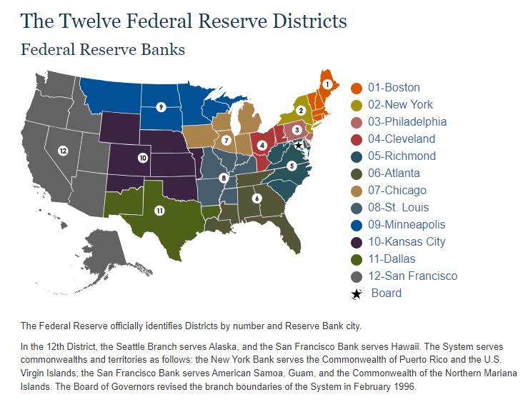

# 美联储讲话数据梳理

@author: Wubin Zhang/01208663

@dept: AI LAB of CMBCHINA

@date: Sep 29, 2024

## 1 美联储组织结构与运作
美联储(The Federal Reserve, FED)是美国的中央银行，致力于培育健全的金融体系和健康的经济，美联储的公共服务使命是通过促进我国货币、金融和支付系统的稳定性、完整性和效率来加强经济和社区，同时也负责制定和执行美国的货币政策。

美联储于1913年由国会成立，通过以下方式促进健康的经济和金融稳定：
- 制定国家的货币政策，以促进就业最大化、物价稳定和长期利率适度的经济目标。
- 通过监控金融体系风险和参与国内外支持美国家庭、社区和企业的健康经济，促进金融体系稳定。
- 监督和规范金融机构，以帮助确保个别机构的安全和稳健，并监测其对整个金融体系的影响。美联储还向存款机构、美国政府和外国官方机构提供金融服务。
- 建立一个安全、高效、便捷的美元交易和电子资金转账支付系统。
- 通过与个人、社区和商业领袖接触，促进消费者保护和社区发展，更好地了解当地经济状况、问题以及金融服务政策和实践对消费者和社区的影响。


**美联储的双重使命**

保持经济健康是美联储最重要的职责之一。美联储系统肩负双重使命——`追求充分就业`和`维持稳定物价`的经济目标。它通过使用各种政策工具来管理金融状况，以促进实现其双重使命目标——换句话说，实施货币政策。

美联储的双重使命之一是价格稳定。价格稳定意味着通胀在较长时期内保持在低位和稳定。当通胀处于低位和稳定时，人们可以持有货币而不必担心高通胀会侵蚀其购买力。例如，2%的年通胀率意味着——平均而言——一美元所能购买的商品和服务比前一年减少了2%。这似乎是可以控制的，但如果是10%呢？有了稳定的价格，消费者和企业在制定计划或长期借贷时就不必担心价格上涨或下跌。简而言之，当通胀处于低位和稳定时，经济可以有效运行。但低到什么程度才算低呢？美联储寻求实现长期平均2%的通胀率。

在实施货币政策时，我们将继续高度关注培育尽可能强劲的劳动力市场，以造福所有美国人。我们将坚定不移地寻求实现 2% 的通胀率。

美联储双重使命的另一部分是最大限度就业。最大限度就业的概念可以被认为是经济在一段时间内能够维持的最高就业水平。当然，衡量这一概念很难，因为最大限度就业水平会随着商业状况、人口结构、劳动力市场法规和其他因素而随时间而变化。相反，美联储会考虑各种就业指标来估计就业水平与最大限度就业水平之间的差距。简而言之，美联储并没有为就业水平设定一个数字目标；相反，美联储会利用各种数据分析经济状况，以制定实现最大限度就业的政策。

美联储的最大就业和价格稳定目标通常是相辅相成的。低而稳定的通货膨胀率的经济提供了有利于商业规划、储蓄和投资的经济条件，从而促进经济增长。不断增长的经济需要工人来生产商品和服务。当然，有时这两个目标并不相辅相成。例如，在 20 世纪 70 年代末和 80 年代初，经济同时经历了高通胀和高失业率（低就业率）。美联储决定通过将利率提高到非常高的水平来降低高通胀率，这导致了两次连续的经济衰退。随着时间的推移，通货膨胀率回到了低而稳定的水平，经济复苏，失业率下降，这意味着就业水平上升到最大就业水平。
### 1.1 美联储的三个实体
美联储有三个实体，分别是美联储理事会(Board of Governors, BOG)、十二家地方联储银行(Federa Reserve Bank)以及美联储公开市场操作委员会(Federal Open Market Commitee, FOMC)。

#### 1.1.1 美联储理事会BOG
美联储理事会(Board of Governors, BOG)位于首都华盛顿特区，理事会通常由7名成员组成，包括一名主席(Chair)、一名副主席(Vice Chair)、一名主导监管的副主席(Vice Chair for Supervision)和其他四位普通理事(Governor)。

理事会的七名成员由美国总统提名并经参议院批准。一个完整的任期是14年。理事的任命是错开的，每两年开始一个任期，在每个偶数年的2月1日开始。任期满的委员不得连任；但是，被任命和确认为任期届满的成员可在以后被重新任命为一个完整的任期。不论议员宣誓就职的日期，所有任期均于其法定日期结束。

董事会主席和副主席由总统从董事会成员中提名，并经参议院批准。他们的任期为四年。董事会成员的任期不受其主席或副主席身份的影响。

#### 1.1.2 十二家地区性联储银行FRB
联邦储备系统包括分布在美国各地的12家独立的地区性储备银行(Federa Reserve Bank)，以及位于华盛顿特区的联邦储备委员会FOMC。


12家联邦储备银行中的每一家都是联邦储备系统的操作部门。这些银行共有24家分行。这些银行和分支机构执行各种职能，包括经营全国性的支付系统、发行国家的货币和硬币、监督和管理成员银行和银行控股公司，以及担任美国财政部的银行家。

联邦储备银行位于波士顿、纽约、费城、克利夫兰、里士满、亚特兰大、芝加哥、圣路易斯、明尼阿波利斯、堪萨斯城、达拉斯和旧金山。

#### 1.1.3 美联储公开市场委员会FOMC

联邦公开市场委员会（FOMC）是美联储的主要货币政策制定机构，由七名理事会成员、纽约联邦储备银行行长和四位轮流担任的其他储备银行行长组成。所有12位美联储行长都参与了FOMC的政策审议，无论他们是否是有投票权的成员。联邦公开市场委员会通常每年召开八次会议，也就是议息会议。因此，参与议息会议的与会成员共19名，即7名理事会成员和12家地方性储备银行行长，但其中仅有12名具有投票权，称之为十二票委。

十二家地方性联储银行中纽约联储银行影响力较大，其同时担任FOMC的副主席并拥有永久投票权，其余11家地方性联储银行分四组进行轮值，每年
议息(https://www.stlouisfed.org/open-vault/2022/nov/fomc-voting-rotation-explained)看到解释。


## 2 美联储官员演讲数据梳理
**议息决议Statement**
2019年以前的议息决议数据在[FOMC历年资料网址](https://www.federalreserve.gov/monetarypolicy/fomc_historical_year.htm)可以获取。


**会议纪要Minutes**


### 2.1 美联储理事会演讲稿数据
```markdown
下面这个网站存有美联储历年议息会议的数据，并且以每个自然年的形式给出。
https://www.federalreserve.gov/monetarypolicy/fomc_historical_year.htm
该网址按照每个十年给出了每年议息会议的链接，每个链接中又按照列表控件给出了每次议息会议的数据，其中最重要的是statement(议息决议链接)。
请帮我基于python和selenium开发爬虫程序，爬取2006年后每年的议息决议数据，并以自然年为粒度保存为json文件，最终将所有议息数据保存在一个json文件中。
```

此外，可以[BOG membership网站](https://www.federalreserve.gov/aboutthefed/bios/board/boardmembership.htm)上爬取1936年以来理事会中主席(Chair/Chairman)、副主席(Vice Chair/Chairman)、监管副主席(Vice Chair for Supervision, 2017之后增设)以及其他普通理事的任期表信息。开发的prompt如下：

```markdown
下面这个网站给出了美联储公开市场委员会FOMC中主席、副主席、监管副主席以及理事的任期表信息。
https://www.federalreserve.gov/aboutthefed/bios/board/boardmembership.htm
请帮我基于python和selenium开发爬虫程序，爬取以下三张表：
- 历任主席任期表：Chairs and Active Executive Officers of the Board of Governors of the Federal Reserve System 1936 - Present1
- 历任副主席任期表：Vice Chair of the Board of Governors of the Federal Reserve System 1936 - Present
- 历任监管副主席任期表：Vice Chair for Supervision of the Board of Governors of the Federal Reserve System 2017 - Present
- FOMC普通理事任期表：Members of the Federal Reserve Board and Board of Governors of the Federal Reserve System
```

### 2.2 十二家地方联邦储备银行演讲稿数据
十二家联邦储备银行的演讲数据网址如下：

- [1A 波士顿Boston](https://www.bostonfed.org/news-and-events/speeches.aspx)
- [2B 纽约NewYork](https://www.newyorkfed.org/newsevents/speeches/index)
- [3C 费城Philadelphia](https://www.philadelphiafed.org/search-results?searchtype=speeches)
- [4D 克利夫兰Cleveland](https://www.clevelandfed.org/collections/speeches?df=1980-1-1&dt=2025-12-31)
- [5E 里士蒙德Richmond](https://www.richmondfed.org/press_room/speeches)
- [6F 亚特兰大Atlanta](https://www.atlantafed.org/news/speeches)
- [7G 芝加哥Chicago](https://www.chicagofed.org/publications/speeches/speech-archive)、[芝加哥历任主席](https://www.chicagofed.org/people/chicago-fed-presidents)
- [8H 圣路易斯St.Louis](https://www.stlouisfed.org/events)
- [9I 明尼阿波利斯Minneapolis](https://www.minneapolisfed.org/publications-archive/all-speeches)
- [10J 堪萨斯Kansas City](https://www.kansascityfed.org/search/?filter-section=page&sorting=recent&page-filter-category=6&6-12=1032%2C5803%2C14344%2C1044%2C1175%2C6004%2C7618%2C14391%2C975%2C14809%2C11588%2C5804%2C5801%2C1023%2C1186&6-13=19%2C27%2C31%2C38%2C41%2C44%2C45%2C78%2C87%2C90%2C324%2C371%2C500&page-number=1&perpage=100)
- [11K 达拉斯Dallas](https://www.dallasfed.org/news/speeches)
- [12L 旧金山San Fransicso](https://www.frbsf.org/news-and-media/speeches/)

数据爬虫开发的基本思路：

- a. 先展开所有页面，或者设置点击下一页的按键。
- b. 搜集每个自然年的演讲报告的信息。
- c. 遍历所有演讲的网页，提取正文内容。
- d. 按照自然年，将正文内容存储到本地。
- e. 更新机制：
  - 1) 读取本地演讲信息文件，获取其中最新的演讲时间`latest_date`，转换为标准格式(%B %d, %Y)。
  - 2) 检查网页上最新的报告是否最新，如果是最新则直接跳过更新过程。
  - 3) 否则遍历所有演讲信息，过滤已存储最新演讲时间`latest_date`之前的演讲，获取每年的演讲正文，读取本地演讲内容并且合并后进行更新存储。


#### 1A 波士顿联储爬取开发


#### 2Y 纽约联储爬取开发


#### 3C 费城联储爬取开发
[费城联储银行历史演讲](https://www.philadelphiafed.org/search-results?searchtype=speeches)搜集了历任行长的演讲，大部分是以文本形式给出，适合爬取。

#### 4D 克利夫兰联储爬取开发
爬虫开发代码生成的Prompt如下:
```markdown
# 克利夫兰联邦储备银行演讲数据prompt
下面这个网站是克利夫兰联邦储备银行(Federal Reserve Bank of Cleveland)的领导人发表演讲的网址：
https://www.clevelandfed.org/collections/speeches
首先将Date range from下面的两个时间选择控件的年份选择分别设置为最早和最晚。
其次，该网址分多页展示了有记录以来每次克利夫兰联邦储备银行领导人的演讲(Speech)，每一条演讲内容的信息包括演讲链接、演讲人、演讲时间、摘要，其中日期的格式如`05.28.2024`，链接文本为演讲标题。
请帮我开发python代码，基于selenium和beautifulsoup4来爬取每一篇演讲的信息，并且按照年份进行整理，最终将每年的演讲信息保存为一个json文件。每一篇演讲(Speech)的信息由一个字典来描述，包括如下键：
- date: 演讲日期
- speaker: 演讲人
- title: 演讲题目
- href: 演讲链接
- highlights: 演讲摘要
- content: 演讲内容
```


#### 5E 里奇蒙德联储爬取开发


#### 6F 亚特兰大联储爬取开发
爬虫开发代码生成的Prompt如下:
```markdown
# 亚特兰大爬取数据prompt
下面这个网站是亚特兰大联邦储备银行的领导人发表演讲的网址：
https://www.atlantafed.org/news/speeches
该网址可以根据下拉框选择自然年来查看每年亚特兰大联邦储备银行领导人的演讲，每一条演讲内容的信息包括日期、演讲链接、摘要，其中日期的格式如Sep 23, 2024，链接文本为演讲标题。
请帮我开发python代码，基于selenium和beautifulsoup4来爬取每一篇演讲的信息，并且按照年份进行整理，最终将每年的演讲信息保存为一个json文件。每一篇演讲(Speech)的信息由一个字典来描述，包括如下键：
- date: 演讲日期
- speaker: 演讲人
- title: 演讲题目
- href: 演讲链接
- highlights: 演讲摘要
- content: 演讲内容
```


#### 7G 芝加哥联储爬取开发
芝加哥联储银行没有给出speeches的链接，但是可以从历任行长列表中分别查看到每位行长的历史演讲记录。
芝加哥现任联储行长Goolsbee在2023年担任FOMC轮值票委，当年许多演讲稿文本会给出，但有的同样只提供youtube链接。
演讲数据搜集过程：
1) 历任行长首页 -> 搜集历任行长介绍信息
2) 进入历任行长主页，点击speeches
3) 搜集speeches的信息
4) 逐一收集所有speech的正文

#### 8H 圣路易斯联储爬取开发


#### 9I 明尼阿波利斯联储爬取开发
[明尼阿波利斯联储历来演讲](https://www.minneapolisfed.org/publications-archive/all-speeches)全都搜集在一起，但现任行长Neel Kashkari的演讲很多都是以Youtube链接给出的，或者从FRESER上可以获取到[明尼阿波利斯历任行长的讲话数据](https://fraser.stlouisfed.org/series/statements-speeches-presidents-federal-reserve-bank-minneapolis-3765#1002)，但不是很全，连现任主席卡什卡利的讲话数据都没有。


#### 10J 堪萨斯联储爬取开发
我们只需要提取最近的三位行长的讲话数据，分别如下：
- Thomas M. Hoenig, 1991-2011
- Esther L. George, 2011-2023
- Jeffrey Schmid, 2023-Present

截止2014-10-24，这三位行长共有93条讲话记录，我们爬取了所有演讲的链接，发现仅有一次是youtube形式提供，其余皆为pdf文档形式提供。
目前PDF文档已经全部下载。

#### 11K 达拉斯联储爬取开发
达拉斯联储银行同样没有给出历史所有演讲的清单，而是分段进行了搜集，给出了现任行长Lorie K. Logan从2017年至今的演讲以及前任行长Richard Fished在2005年至2015年的演讲，
以及前任行长Robert S. Kaplan的演讲。
*注意：搜集的行长演讲可能包含他在其他机构任职时候的演讲链接，比如现在Logan行长此前曾在纽约联储担任高级副行长，那时候的演讲链接同样被搜集进去。
Logan行长在August 22, 2022才就职达拉斯联储行长。


#### 12L 旧金山联储爬取开发

有关正文提取内容失败，可能是以下几种情况：

- 演讲内容不刊载，而是提供pdf下载链接。
- 以youtube链接的形式提供。

爬虫开发代码生成的Prompt如下:
```markdown
# 旧金山联邦储备银行演讲数据prompt
下面这个网站是旧金山联邦储备银行(Federal Reserve Bank of San Francisco)的领导人发表演讲的网址：
https://www.frbsf.org/news-and-media/speeches/
该网址分多页展示了有记录以来每次旧金山联邦储备银行领导人的演讲(Speech)，每一条演讲内容的信息包括演讲链接、演讲人、演讲时间、摘要，其中日期的格式如`June 28, 2024`，链接文本为演讲标题。
请帮我开发python代码，基于selenium和beautifulsoup4来爬取每一篇演讲的信息，并且按照年份进行整理，最终将每年的演讲信息保存为一个json文件。每一篇演讲(Speech)的信息由一个字典来描述，包括如下键：
- date: 演讲日期
- speaker: 演讲人
- title: 演讲题目
- href: 演讲链接
- highlights: 演讲摘要
```

### 2.3 美联储经济和金融历史数字图书馆FRESER
[美联储经济和金融历史数字图书馆(Federal Reserve Archival, FRESER)](https://fraser.stlouisfed.org/archival)是美国经济、金融和银行历史的数字图书馆，尤其是联邦储备系统的历史，提供访问超过50万的历史数据，研究和政策文件。

向公众提供经济信息和数据是圣路易斯联邦储备银行的一项重要使命，由前圣路易斯联邦储备银行研究部主任霍默·琼斯于1958年创立。弗雷泽始于2004年圣路易斯联邦储备银行的数据保存和可访问性项目，现在提供来自联邦储备系统和许多其他机构的数据和政策文件的访问。

这项任务的一部分包括寻找范围广泛的历史材料。有关弗雷泽收藏范围的详细概述，请参阅收藏发展政策或突出显示的内容列表。在某些情况下，我们会努力填补馆藏的空白。我们的需求清单确定了完成弗雷泽现有馆藏所需的具体文件，以及我们尚未数字化但希望数字化的材料。为了更好地告知我们的用户，我们的工作人员偶尔会从其他来源（如互联网档案和美国国会图书馆的美国记忆计划）向FRASER添加数字材料，以便为FRASER数字化的材料提供进一步的背景。

弗雷泽可以与其他美联储资源结合使用，包括FRED， ALFRED，美联储历史网站，以及美联储经济教育人员开发的课程材料。为了将公众与我们的免费经济史材料联系起来，我们的工作人员还从相关的维基百科页面添加了弗雷泽资源的链接。

API KEY： cf24df6c394eb609e20cb6ebabb9dac6
美联储档案馆的API获取
```
curl --data '{"email": "wbzhang233@163.com", "description": "AIP Key of FRASER"}' https://fraser.stlouisfed.org/api/api_key

# 通过FRESER获取美联储FOMC官员历来讲话和决议数据
https://fraser.stlouisfed.org/search.php?sort=sort_date_text+desc&start=1&page=1&adv_query%5B0%5D%5Boperator%5D=and&adv_query%5B0%5D%5Bfield%5D=all&adv_query%5B0%5D%5Bvalue%5D=speeches&facets%5B%5D=decade%3A2000-2020
# 一些可用于搜索的标题如下：
十二联储银行：Statements and Speeches of Presidents of the Federal Reserve Bank of {$BANK$}, eg. St. Louis, Minneapolis
FOMC参与者: Statements and Speeches of Federal Open Market Committee Participants
BOG理事：Statements and Speeches of Members of the Board of Governors of the Federal Reserve System
BOG主席：Statements and Speeches of the Chair of Board of Governors of the Federal Reserve System
FED官员：Statements and Speeches of Federal Reserve Officials
```
FRESER还提供了一系列接口，我进行了尝试但发现有的接口无法获取数据，例如/title/{titleId}/items，因此只能使用爬虫。


### 2.4 美联储数据库FRED
API KEY: 20f26047cd647757f26d3b0f4a45e77a

联邦储备经济数据(Federal Reserval Economic Data, FRED)是一个在线数据库，由来自国家、国际、公共和私人来源的数十万个经济数据时间序列组成。FRED是由圣路易斯联邦储备银行研究部创建和维护的，它远不止简单地提供数据：它将数据与强大的工具组合在一起，帮助用户理解、交互、显示和传播数据。从本质上讲，FRED帮助用户讲述他们的数据故事。本文的目的是通过数据库的各个方面和工具来指导潜在的（或当前的）FRED用户。


## 3. 美联储官员讲话分析
### 3.1 美联储官员鹰派和鸽派定义
美联储有两个长期目标：控制通胀(Hawkish)和最大化就业(Dovish)，但这两个目标常常背道而驰，因此美联储也常被形容为鸽派和鹰派。
美联储官员的鹰派和鸽派区分主要基于他们对货币政策的立场，尤其是在控制通胀和刺激经济增长之间的取向。
1. **鹰派（Hawks）**：

   - 鹰派官员更关注控制通胀，他们倾向于通过提高利率来抑制通胀，即使这可能会牺牲一定的经济增长、消费者支出和就业。
   - 鹰派认为，高利率有助于防止经济过热和控制价格增长，即使这可能导致经济收缩和失业率上升。
   - 鹰派政策的优点包括可以遏制通胀、提高储蓄率、降低进口商品价格和增强游客在国外的购买力。缺点则包括可能伤害国内生产者、增加消费者和企业的借贷成本、可能导致通货紧缩等。
   - 鹰派的政策立场更激进，类似于鹰这种猛禽的特性，因此得名。
2. **鸽派（Doves）**：

   - 鸽派官员更关注刺激经济增长和就业，以此来降低失业率，他们倾向于采取更为宽松的货币政策，比如维持较低的利率，以促进经济增长和就业。
   - 鸽派认为，低利率可以刺激经济活动，增加就业机会。
   - 鸽派政策的优点包括促进经济增长和就业，但缺点可能包括引发通胀和资产泡沫。
   - 鸽派的政策立场更温和，类似于鸽子这种象征和平的鸟类，因此得名。

美联储官员的立场可能会根据经济状况的变化而变化。例如，如果通胀压力增大，一些官员可能会采取更鹰派的立场；而在经济增长放缓时，他们可能会转向更鸽派的政策。这种立场的变化有助于美联储在不同的经济环境下实现其双重使命：控制通胀和促进最大就业。


### 3.2 美联储FOMC议息决议

### 3.3 美联储FOMC会议纪要

## 参考资料
[如何从网站的交互式折线图中导出数据](https://zhuanlan.zhihu.com/p/368485448)

